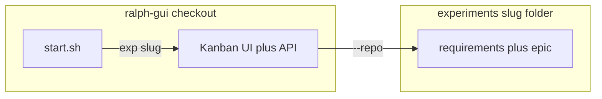

# Ralph GUI experiments

## What counts as an experiment

`experiments/<slug>/` is a **target repository** for the Ralph loop (same contract as any `--repo` path). It is **not** a second app server inside ralph-gui.

**Ship up front:**

- One requirements file (any of these paths, same gate as the loop uses):
  - `requirements.md`, `REQUIREMENTS.md`, `Requirements.md`
  - `docs/requirements.md`, `docs/REQUIREMENTS.md`
- `ralph/epic.md` — current epic
- Optional **`material/`** — screenshots and other static reference assets (not part of the built app); keeps curated material separate from `src/` and build output

**Appears as the loop runs:** `ralph/task-status.json`, prompt files under `ralph/`, and (when Dev implements) `package.json`, `src/`, etc.

**Do not** import from the parent Kanban app’s `src/`; keep the target repo self-contained.

## Launch Kanban on an experiment

From **ralph-gui repository root**:

| Command | Effect |
|--------|--------|
| `./start.sh exp <slug>` | Build Kanban, start server, `--repo` = `$(pwd)/experiments/<slug>` |
| `npm run exp -- <slug>` | Same (shell forwards extra args to `start.sh`) |
| `./start.sh exp` | Usage + list slugs (dirs with a requirements file) |
| `npm run exp` | Same listing (run with no slug; no `--` needed) |

Then open `http://localhost:3001` and start the loop from the UI, unless you passed `--start`.

**Headless:** `./start.sh exp <slug> --start` (same requirements as any `--repo` + `--start` run: epic configured, Copilot, etc.).

## Reset one experiment only

Delete `experiments/<slug>/ralph/task-status.json` (after Ralph has created it). Do not delete ralph-gui’s own `ralph/` at the repo root unless you mean to reset the Kanban project itself.

## New experiment checklist

1. Add `experiments/<slug>/` with a requirements file + `ralph/epic.md`. Optionally add **`material/`** for screenshots and other static reference assets (not app source); keep requirements and epic at the experiment root.
2. Confirm it appears in `./start.sh exp` (listing).
3. Run `./start.sh exp <slug>` and drive the loop from the Kanban UI.

See also: repo root `README.md` (Experiments + Required Requirements File), [`experiments/README.md`](../../../experiments/README.md).
