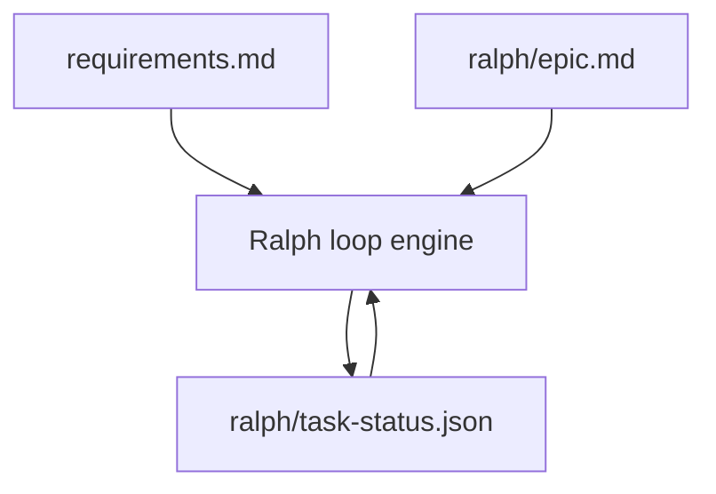
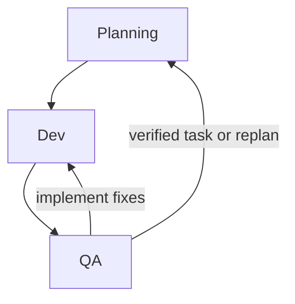
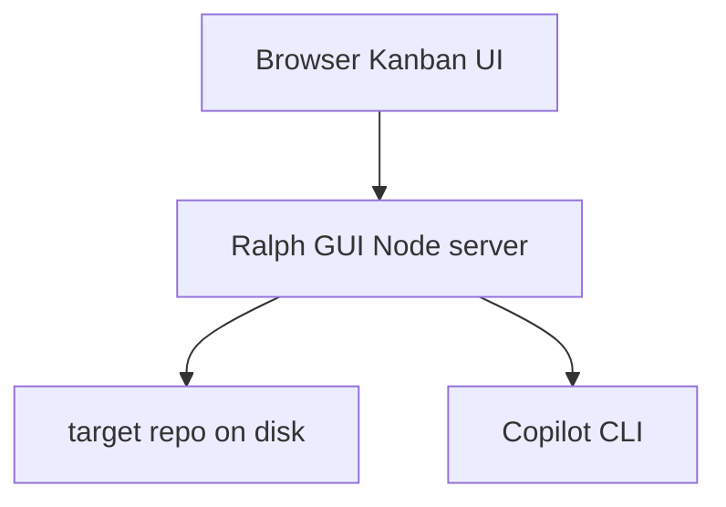
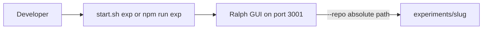

# Ralph GUI

Ralph is an Epic-driven local orchestration loop for software delivery.

It takes a current epic, plans a backlog of tasks from that epic plus the project requirements, executes tasks in a Dev -> QA loop, and persists all runtime state in `ralph/task-status.json`.

### Reset

Remove `ralph/task-status.json` to start a clean loop, otherwise it will try to continue from where it left off.

## Core Concepts

RUN THIS IN A SANDBOX. With the **GitHub Copilot** backend (default), the loop calls `copilot` in "yolo" mode. Other backends are also launched with backend-specific non-interactive/permissive flags so the loop can proceed unattended: Cursor Agent is run with `--output-format text`, Claude is run with `--permission-mode bypassPermissions --output-format text`, Gemini is run with `--yolo --output-format text`, and OpenCode is run with `--dangerously-skip-permissions`. These modes can reduce or bypass interactive safety prompts, so backend selection has real safety implications and should only be used in isolated environments.

- `requirements.md`:
  The authoritative product requirements document for the overall project. If this is defined elsewhere, just reference those documents in requirements.md. 
  Ralph treats this as the source of truth for the project and must fit its work within those bounds.
- `ralph/epic.md`:
  The current epic Ralph should execute right now.
  The planner uses this to prioritize and sequence tasks.
- `ralph/task-status.json`:
  Task state, next task content, feedback, counters, and blocked metadata.



## Loop Phases

Ralph uses one planning prompt plus Dev and QA prompts:

1. Planning:
   - Reads requirements + epic + codebase state
   - Produces refreshed backlog tasks
   - Orders tasks in backlog by optimal completion order
2. Dev:
   - Implements the selected task
3. QA:
   - Verifies the implementation and returns either verified feedback or actionable fixes



Planning populates and refreshes backlog. Modifying the epic requirements, the agents.md, requirements.md or anything else that would be brought into context will be considered in the next planning loop, which might cause the backlog items to change.

## Prerequisites

- Node.js 20+
- npm 10+
- Git
- **One** installed and authenticated CLI for the agent backend selected in Settings (`ralph/settings.json`), or via `--agent-backend`:

| Backend | Executable | Override env var |
| --- | --- | --- |
| Copilot (default) | `copilot` | `COPILOT_BIN` |
| Cursor Agent | `cursor-agent` | `CURSOR_AGENT_BIN` |
| Claude Code | `claude` | `CLAUDE_BIN` |
| Google Gemini CLI | `gemini` | `GEMINI_BIN` |
| OpenCode | `opencode` | `OPENCODE_BIN` |

Plan, dev, and QA **model names are backend-specific**: what works for Copilot may not apply to Claude Code, Cursor Agent, Gemini CLI, or OpenCode—see each vendor’s CLI documentation.

Reasoning effort support is backend-specific:

| Backend | Dev/QA reasoning effort setting support |
| --- | --- |
| Copilot | Supported (`--reasoning-effort`) |
| Claude Code | Supported (`--effort`) |
| Cursor Agent | Not supported (setting is ignored) |
| Google Gemini CLI | Not supported (setting is ignored) |
| OpenCode | Not supported (setting is ignored) |

If a CLI is not on `PATH`, set the matching `*_BIN` variable to the full executable path (especially on Windows when the command is `copilot.cmd`, `cursor-agent.cmd`, etc.).

## Quick start

```bash
./start.sh
```
Navigate to: `http://localhost:3001` and modify the epic, settings, and repo root. Hit run and monitor from there.


## Local Development

```bash
npm install
npm run dev
```

- Backend: `http://localhost:3001`
- Frontend: Vite dev server



## "Headless Loop" (No UI Required)

Use `start.sh` with a repo and optional settings overrides. The UI is still there, but with this you don't *need* to use it. 

```bash
./start.sh \
  --repo /absolute/path/to/target-repo \
  --start \
  --agent-backend copilot \
  --plan-model claude-sonnet-4.6 \
  --dev-model gpt-5-mini \
  --qa-model gpt-5-mini \
  --dev-reasoning-effort xhigh \
  --qa-reasoning-effort high \
  --max-llm-calls 300 \
  --plan-frequency 1 \
  --min-backlog-size 3 \
  --auto-commit false \
  --exit-when-complete
```

Behavior:

- installs dependencies if needed
- builds the UI assets
- starts server
- starts loop only when `--start` is passed
- `--start` requires `--repo`, and `ralph/epic.md` must be filled out (not default placeholder)
- optionally exits server when epic completes via `--exit-when-complete`

Use `./start.sh --help` for options.

## Fleet Mode (Copilot only)

Fleet mode prefixes the dev and QA prompts with `/fleet` before sending them via stdin to the Copilot CLI. This enables parallel subagent execution for tasks that benefit from it.

- **Default: off.** Enable in Settings → Loop Configuration → Fleet mode.
- Only available when `agentBackend` is `copilot`. The checkbox is grayed out for other backends.
- Fleet mode is **not** applied to the planning phase.
- May increase premium request usage; see GitHub Copilot billing documentation.

CLI flag: `--fleet true|false`

## Docker Agent Execution

Ralph can run coding agents inside a Docker container with the target repository bind-mounted to `/workspace`. This is useful for isolation, reproducibility, and controlled toolchain environments.

### Prerequisites

- Docker Engine or Docker Desktop + Compose plugin installed and running
- The agent CLI you want to use installed inside the container (see [`docker/README.md`](docker/README.md))

### Quick start

```bash
# Start the bundled ralph-agent container (from ralph-gui root)
docker compose -f docker-compose.agents.yml up -d
```

### Settings

The Settings panel is collapsible: **Docker Agents**, **Loop Configuration**, **Current Epic**, and **Prompts** sections can be individually expanded or collapsed, with **Collapse all / Expand all** controls at the top. Each section has its own **Save** button (enabled only when you have unsaved changes in that section) and a **Reset** button that reverts the draft to the last-saved server state without making an API call.

Enable **Run agents in Docker** in Settings → Docker Agents. Configure:

| Setting | Purpose |
|---------|---------|
| Compose File | Path to docker-compose file (blank = bundled `docker-compose.agents.yml`) |
| Service Name | Compose service to exec into (default: `ralph-agent`) |
| Isolate on work branch | Create a `ralph/epic-*` branch so agent commits are isolated from your base branch |
| Pool size | Number of containers to run in parallel (default `1`, max `8`) |
| Run backlog tasks in parallel | When `dockerPoolSize > 1`, run dev+QA phases for multiple backlog tasks simultaneously using git worktrees. (Disabled when pool size is 1.) |
| Parallel plan research | *(Stretch)* When the plan agent emits `<research-prompt>` blocks, dispatch them concurrently across pool slots and merge task results back into the backlog. Requires pool size > 1. Increases API usage proportionally. |
| Allow agents to run Docker | Mount host Docker socket into agent containers so they can `docker compose` inside the target repo. **Grants host-level Docker control — only enable on trusted machines.** |

Click **Set Docker** to validate. Ralph checks the Docker daemon, compose file, basic tools (`node`, `pnpm`, `git`), the active backend CLI, and any additional CLIs listed in `dockerInstalledBackends`.

### Authentication and environment variables

Agents run **inside** the container. Host logins (for example `copilot login` on your machine) do not apply unless you pass credentials into the container.

1. Create **`ralph-gui/.env`** next to `docker-compose.agents.yml` (see [`.gitignore`](.gitignore) — do not commit this file).
2. Set the variable for the backend selected in Settings (`agentBackend`).
3. Recreate the container after any change:

```bash
docker compose -f docker-compose.agents.yml up -d --force-recreate ralph-agent
```

| Backend | Env var(s) | Token / key requirements (summary) |
|---------|------------|--------------------------------------|
| **Copilot** (default; CLI preinstalled in image) | `COPILOT_GITHUB_TOKEN`, or `GH_TOKEN`, or `GITHUB_TOKEN` | Fine-grained PAT (`github_pat_…`) on **your user** with account permission **Copilot Requests**; or OAuth `gho_…`. Classic `ghp_…` PATs are **not** supported. Requires an active GitHub Copilot subscription. |
| **Claude** | `ANTHROPIC_API_KEY` | Anthropic API key; install `claude` in the image first. |
| **Gemini** | `GEMINI_API_KEY` | Google AI Studio API key; install `gemini` in the image first. |
| **Cursor Agent** | `CURSOR_API_KEY` | Cursor API key from the dashboard; install `cursor-agent` in the image first. |
| **OpenCode** | `OPENCODE_API_KEY` | OpenCode Zen API key from [opencode.ai/auth](https://opencode.ai/auth); install `opencode` in the image first. Free `opencode/*` models do not need separate provider keys. |

Optional git identity overrides: `GIT_AUTHOR_NAME`, `GIT_AUTHOR_EMAIL`, `GIT_COMMITTER_NAME`, `GIT_COMMITTER_EMAIL`.

**Step-by-step setup** (`.env`, tokens, validate, troubleshoot): [`docker/README.md`](docker/README.md) — start at [Step 2 — Add authentication](docker/README.md#step-2--add-authentication-env).

**Custom image in the target repo** (override bundled compose/Dockerfile): [`docker/local-repo-image-override.md`](docker/local-repo-image-override.md).

### Branch workflow

When `useDocker` + `dockerIsolateBranch` is enabled:

1. At loop start, the current branch is saved as **Epic Base Branch**.
2. A work branch `ralph/epic-<slug>` is created from the base branch.
3. All agent commits land on the work branch (host and container share the same `.git`).
4. Click **Merge work into epic branch** in the Docker section to merge back.

### Multi-CLI image (build args)

The agent image can include multiple coding-agent CLIs. Install only what you need to keep the image small:

| Build arg | Default | Installs |
|-----------|---------|----------|
| `INSTALL_COPILOT` | `true` | `@github/copilot` CLI |
| `INSTALL_CLAUDE` | `false` | `@anthropic-ai/claude-code` CLI |
| `INSTALL_GEMINI` | `false` | `@google/gemini-cli` CLI |
| `INSTALL_CURSOR` | `false` | Cursor Agent CLI (see `docker/README.md` for manual steps) |
| `INSTALL_OPENCODE` | `false` | OpenCode CLI (see `docker/README.md`) |
| `INSTALL_DOCKER_CLI` | `false` | Docker CLI + Compose plugin (required for nested compose — see below) |

Example: build an image with Copilot + Claude:

```bash
INSTALL_CLAUDE=true \
  docker compose -f docker-compose.agents.yml up -d --build
```

Set args in `.env` or export them to the shell before running `compose`. See [`docker/README.md`](docker/README.md) for the full build matrix and pinned version details.

### Container pool (parallel agents)

Set `dockerPoolSize > 1` in Settings to run multiple agent containers simultaneously. Ralph scales the compose service automatically:

```bash
# Manual equivalent — Ralph does this automatically when pool size changes
docker compose -f docker-compose.agents.yml up -d --scale ralph-agent=2
```

When **Run backlog tasks in parallel** is enabled and `dockerPoolSize > 1`:

- Ralph picks up to N backlog tasks at once (where N = pool size).
- Each task runs in its own git **worktree** under `.ralph/worktrees/slot-<n>` so changes don't collide.
- All TaskManager writes are mutex-protected.
- After each task completes, its worktree branch is merged back into the epic work branch.

When **Parallel plan research** is also enabled, the plan agent can additionally emit `<research-prompt>` blocks in its output. Ralph dispatches each block to a pool slot concurrently, aggregates the resulting task lists into the backlog, then continues with the normal dev/QA loop. This is a stretch feature — the plan prompt template must be extended to emit `<research-prompt>` output for it to have any effect.

> **Resource warning:** N parallel agents multiply CPU, RAM, and API quota usage. Enforce a reasonable max in your environment.

Requires a **recent Docker Compose plugin** that supports `compose exec --index N`. If the flag is unsupported, run `docker compose version` and upgrade.

### Fleet vs pool

These two parallelism features are complementary and independent:

| Feature | What it parallelises |
|---------|---------------------|
| **Fleet mode** (`fleetMode`) | Copilot in-container subagents — one container, multiple Copilot threads |
| **Pool** (`dockerPoolSize > 1`) | Multiple containers — different backlog tasks, each in its own worktree |

### Nested Docker (target repo compose stacks)

Some backlog tasks require running `docker compose` inside the agent (for example, starting a full stack then running E2E tests). Enable **Allow agents to run Docker** in Settings:

1. The host Docker socket is mounted into the container at `/var/run/docker.sock`.
2. The agent container must have Docker CLI + Compose plugin — build with `INSTALL_DOCKER_CLI=true`.
3. Click **Set Docker** — validation runs `docker info` and `docker compose version` inside the container.

**Security:** mounting the host socket gives the agent effective host-level Docker control. Never enable in multi-tenant or untrusted environments. Default is off.

When enabled, Ralph injects context into dev/QA prompts so the agent knows it can run `docker compose` against files under `/workspace`.

If the host forbids container creation (no socket, locked-down CI sandbox), the task remains blocked — document "run on a Docker-capable runner" in the task's `blocked.needs`.

### CLI flags

```bash
./start.sh \
  --use-docker true \
  --docker-service ralph-agent \
  --docker-compose path/to/compose.yml   # optional, relative to repo root
```

### Not installed vs daemon stopped

Ralph distinguishes between "Docker not installed" and "Docker daemon not running" and surfaces distinct error messages for each case.

### Troubleshooting

| Symptom | What to check |
|---------|----------------|
| Wrong CLI in image | Rebuild: `INSTALL_CLAUDE=true docker compose -f ... up -d --build` |
| `--index` flag unsupported | Upgrade Docker Compose plugin (`docker compose version` ≥ 2.24) |
| Worktree merge conflict | Use **Merge work into epic branch** in the Docker section; resolve conflicts manually if needed |
| Pool not scaling | Check `docker compose ps` — containers may be stopped; run `up -d --scale N` manually |
| `docker info` fails inside agent | Ensure `INSTALL_DOCKER_CLI=true` image was built and socket mount is enabled |
| `cannot create containers` in task | Enable **Allow agents to run Docker** or run Ralph with `useDocker: false` on the host |

## Settings Defaults

Default loop settings are:

- `maxLLMCalls: 100`
- `planModel: claude-sonnet-4.6`
- `devModel: gpt-5-mini`
- `qaModel: gpt-5-mini`
- `devReasoningEffort: xhigh`
- `qaReasoningEffort: high`
- `autoCommit: false`
- `planFrequency: 1`
- `minBacklogSize: 3`
- `agentBackend: copilot`
- `fleetMode: false`
- `useDocker: false`
- `dockerService: ralph-agent`
- `dockerPoolSize: 1`
- `dockerParallelTasks: false`
- `dockerPlanParallel: false`
- `dockerInstalledBackends: []`
- `dockerMountSocket: false`

Use your selected CLI's help output for supported models (for example `copilot --help`, `claude --help`, `cursor-agent --help`, or `gemini --help`).

## Required Requirements File

Ralph refuses to start unless one exists:

- `requirements.md`
- `REQUIREMENTS.md`
- `Requirements.md`
- `docs/requirements.md`
- `docs/REQUIREMENTS.md`

## Experiments

Sample **target repos** live under `experiments/<slug>/` (requirements file + `ralph/epic.md`). The loop implements the product **inside** that folder. From ralph-gui root, `./start.sh exp <slug>` starts Kanban with `--repo` set to that directory (same as an absolute `--repo` path).



- List slugs: `./start.sh exp` with no second argument, or `npm run exp` alone.
- Optional args pass through: `npm run exp -- todo --start`.
- Experiments may include a `material/` folder for screenshots and other static reference files (see [`experiments/todo/README.md`](experiments/todo/README.md)).
- More detail: [`experiments/README.md`](experiments/README.md). Checklist for authors: [`.cursor/skills/ralph-gui-experiment/SKILL.md`](.cursor/skills/ralph-gui-experiment/SKILL.md).

## Useful Scripts

- `npm run dev`
- `npm run build`
- `npm run server`
- `npm run typecheck`
- `npm run test:ci`
- `npm run exp -- <slug>` (Kanban with `--repo` set to `experiments/<slug>`)
