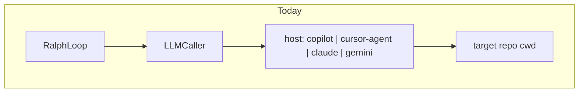
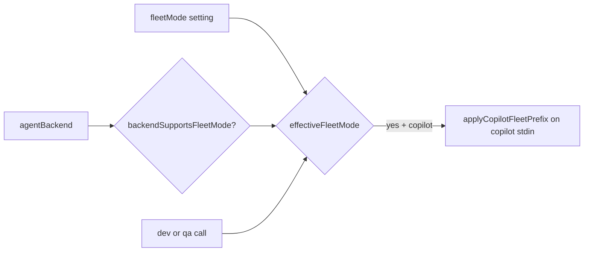
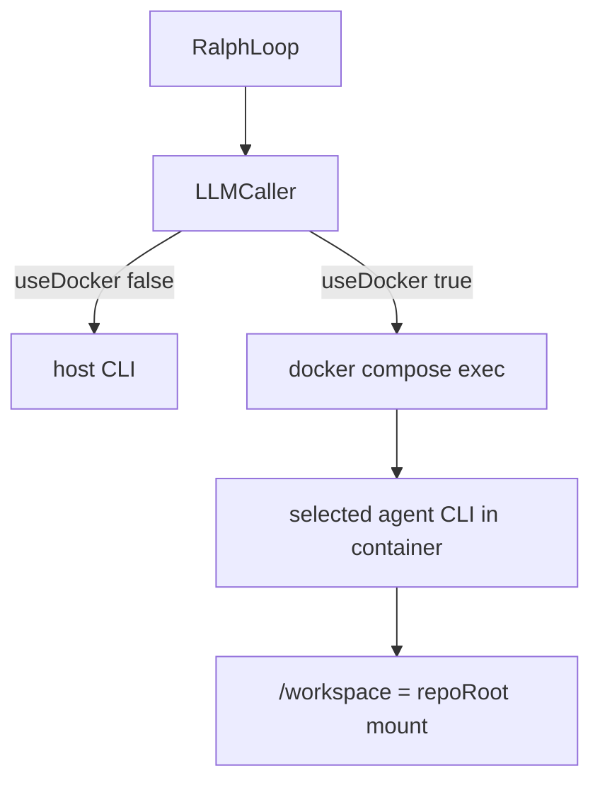
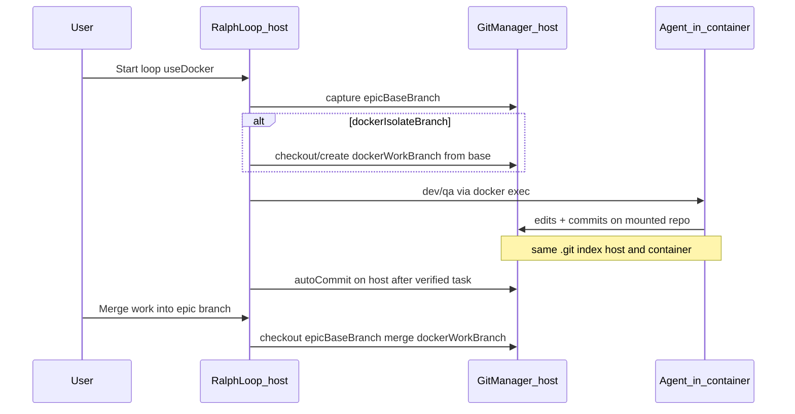

# Epic 003 — Docker container agents, Copilot fleet, Epic Set

**Canonical plan:** [docs/epics/epic-003-docker-container.plan.md](epic-003-docker-container.plan.md) — future updates belong in this file only.

## Goal

1. Add **fleet mode** as a persisted option (grayed out when the selected agent cannot use it); honor it on **dev and QA** only for fleet-capable backends (v1: Copilot CLI `/fleet`).
2. Send agent work to a **Docker container** (image preinstalls **Node, npm, pnpm, git**) so the selected coding agent CLI runs inside the container, with work **merged back** to the git branch in use when the epic loop started.
3. Add a **Set** button beside the Epic File path field to load epic content from disk or offer to create the file from the default template.

## Decisions (locked in)

| Topic | Choice |
|-------|--------|
| Docker compose location | Bundled default in ralph-gui + optional per-repo override via `settings.dockerComposeFile` |
| Fleet phases | Dev + QA only (not plan or backlog refresh) |
| Fleet eligibility | Persisted `fleetMode` toggle always shown; **disabled (grayed)** when `agentBackend` is not fleet-capable; server ignores `fleetMode` unless backend is in `FLEET_CAPABLE_BACKENDS` |
| Fleet-capable backends (v1) | `copilot` only (GitHub Copilot CLI `/fleet` slash command) |
| Docker vs backend | Docker is transport; `agentBackend` still selects copilot / cursor-agent / claude / gemini inside the container |
| Repo sync model | **Bind-mount** target repo to `/workspace` (same working tree on host and container); merge-back is **git branch** reconciliation, not copying files out of the container |
| Epic git branches | Capture **epic base branch** at loop start; optional **work branch** for isolated commits; user-triggered **merge into epic base branch** when done |
| Container toolchain | Preinstall **git**, **Node LTS**, **npm** (with Node), **pnpm** (via Corepack) so agents can run installs, scripts, and git inside the container |
| Docker host checks | When `useDocker` is enabled, detect **Docker CLI missing** vs **daemon not running** and surface distinct error messages before validate/loop start |

## Current state

- **Copilot** runs as a single host subprocess in [`src/server/llm-caller.ts`](../../src/server/llm-caller.ts) with `--autopilot`, stdin prompt, `cwd: repoRoot`.
- **Fleet** is not implemented; upstream Copilot exposes `/fleet` as an interactive slash command (no `--fleet` CLI flag). Non-interactive use prefixes the prompt with `/fleet` before stdin.
- **Docker** does not exist on branch `docker-dev` yet; agents always run on the host.
- **Epic** uses path (`settings.epicFile`) + content ([`EpicSection.tsx`](../../src/client/components/EpicSection.tsx)). Path changes only persist via **Save Settings**; no load/create-on-set flow.



---

## 1. Fleet mode (dev + QA only, capability-gated)

Fleet is a **persisted user preference** that is only **honored** when the active coding agent supports parallel subagent execution. Today that is **Copilot CLI only**; other backends may be added later by extending a single allowlist.

### Capability model (shared client + server)

In [`llm-caller.ts`](../../src/server/llm-caller.ts) (re-export on client via shared types or duplicate constant kept in sync):

```ts
export const FLEET_CAPABLE_BACKENDS = ["copilot"] as const satisfies readonly AgentBackendId[];

export function backendSupportsFleetMode(backend: AgentBackendId): boolean {
  return (FLEET_CAPABLE_BACKENDS as readonly string[]).includes(backend);
}

/** Honor fleet only when setting is on, backend supports it, and caller opts in (dev/qa). */
export function effectiveFleetMode(
  fleetMode: boolean,
  backend: AgentBackendId,
): boolean {
  return fleetMode && backendSupportsFleetMode(backend);
}
```

### Settings and UI

Extend [`Settings`](../../src/server/settings-manager.ts) / client [`Settings`](../../src/client/types.ts):

```ts
fleetMode: boolean; // default false — persisted even when backend cannot use it
```

In [`LoopConfigSection.tsx`](../../src/client/components/LoopConfigSection.tsx):

- **Fleet mode** checkbox is **always visible** (not hidden per backend).
- `disabled={!backendSupportsFleetMode(localSettings.agentBackend)}` — grayed out for cursor-agent, claude, gemini.
- When disabled, show hint: *"Only available for agents that support parallel subagents (currently GitHub Copilot CLI)."*
- When enabled (copilot selected), hint: *"Uses Copilot `/fleet` on dev/QA; may increase premium request usage."*
- Changing **Agent Backend** away from a capable backend leaves `fleetMode` saved in settings but the checkbox is inactive until a capable backend is selected again.

Optional: expose `fleetCapableBackends` on WebSocket `init` / settings payload so the UI does not hardcode the list (server is source of truth).

### Server wiring

- Add `fleetMode?: boolean` to `LLMCallOpts`; `ralph-loop` sets it from settings **only** for dev and QA calls (not plan or backlog refresh).
- Inside `LLMCaller.call()`, compute `const useFleet = effectiveFleetMode(opts.fleetMode ?? false, backend)` before the backend switch.
- Prefix helper (unit tested):

```ts
export function applyCopilotFleetPrefix(prompt: string, enabled: boolean): string {
  if (!enabled) return prompt;
  if (prompt.trimStart().startsWith("/fleet")) return prompt;
  return `/fleet\n\n${prompt}`;
}
```

- In the **`copilot`** branch only: apply prefix when `useFleet` is true before writing stdin.
- Other backends: **never** apply fleet prefix even if `fleetMode` is true in settings (defense in depth).
- Optional: when `useFleet`, pass higher `--max-autopilot-continues` (e.g. setting default 15); keep 5 when fleet is off.



### Tests

- [`llm-caller.test.ts`](../../src/server/llm-caller.test.ts): `effectiveFleetMode` / `backendSupportsFleetMode`; copilot stdin prefixed when `fleetMode: true`; **no** prefix when `fleetMode: true` but backend is `claude`.
- [`components.test.tsx`](../../src/client/components/components.test.tsx): fleet checkbox disabled when agent backend is not copilot; enabled when copilot.

---

## 2. Docker agent execution

Docker is a **transport layer**: `agentBackend` still selects which CLI runs **inside** the container.

### Settings

| Field | Purpose |
|-------|---------|
| `useDocker` | Enable container execution |
| `dockerComposeFile` | Per-repo override (relative to repo root or absolute); empty = bundled default |
| `dockerService` | Compose service name (default `ralph-agent`) |

### Bundled + override compose

New files at ralph-gui repo root:

- [`docker-compose.agents.yml`](../../docker-compose.agents.yml) — default when `dockerComposeFile` is empty
- [`docker/Dockerfile`](../../docker/Dockerfile) — agent runtime image (see below)
- [`docker/README.md`](../../docker/README.md) — auth env vars, `docker compose up -d`, repo mount, branch workflow

#### Dockerfile baseline (preinstall toolchain)

Use a Node LTS base (e.g. `node:22-bookworm`) and install tooling **in the image** (not at container start):

| Tool | Install approach |
|------|------------------|
| **git** | `apt-get install -y git` (or equivalent on base image) |
| **Node + npm** | Included with official `node` image |
| **pnpm** | `corepack enable` + `corepack prepare pnpm@latest --activate` |
| **Agent CLIs** | Documented optional layers / build args (Copilot, Cursor, Claude, Gemini) — at minimum PATH must resolve the backend selected in settings |

Also set container git identity for agent commits (build-time or entrypoint defaults, overridable via env):

- `GIT_AUTHOR_NAME` / `GIT_AUTHOR_EMAIL` (and committer vars) passed from compose `environment` or `.env`

Validate in `POST /api/docker/validate`: `docker compose exec … node -v`, `pnpm -v`, `git --version`.

Compose sketch:

- Service `ralph-agent`, `working_dir: /workspace`
- Bind-mount `${RALPH_REPO_ROOT:-.}:/workspace` (Ralph sets `RALPH_REPO_ROOT` to `loop.repoRoot` when spawning) — **host and container share one working tree and one `.git`**
- Pass through host env for CLI auth via `env_file: .env` or documented `environment` list
- Mount `~/.gitconfig` read-only **optional** (document tradeoff) so agent git behavior matches developer machine

Per-repo override: if `dockerComposeFile` is set, resolve `path.join(repoRoot, file)` when relative, else use as absolute.

Bundled path resolved at runtime from package dir (`import.meta.url`), same pattern as [`templates.ts`](../../src/server/templates.ts).

### New module: `docker-runner.ts`

- `resolveComposeFile(settings, repoRoot, packageRoot): string`
- `buildDockerSpawn(command, args, opts)` → `docker compose -f <file> exec -T -w /workspace <service> <command> ...args`
- **`checkDockerHost(): Promise<DockerHostCheck>`** — run before compose validation, loop start, and **Set Docker** when `useDocker` is on

#### Docker host detection (`useDocker` enabled)

Probe the **host** (not the container) in order:

1. **CLI installed?** — spawn `docker` (or `docker.exe` on Windows) with `version --format '{{.Client.Version}}'` (or `docker --version`).  
   - `ENOENT` / exit indicating missing binary → `{ ok: false, reason: "not_installed", message: "Docker is not installed. Install Docker Desktop or the Docker Engine package for your OS, then retry." }`
2. **Daemon running?** — `docker info` (short timeout, e.g. 5s).  
   - Non-zero exit or stderr containing `Cannot connect to the Docker daemon` / `Is the docker daemon running` → `{ ok: false, reason: "not_running", message: "Docker is installed but the daemon is not running. Start Docker Desktop or the docker service (e.g. sudo systemctl start docker), then retry." }`
3. **Compose available?** (sub-check after daemon OK) — `docker compose version`.  
   - Missing compose plugin → `{ ok: false, reason: "compose_missing", message: "…" }` (distinct from install/running)

Export typed result for API/UI:

```ts
export type DockerHostCheck =
  | { ok: true }
  | { ok: false; reason: "not_installed" | "not_running" | "compose_missing"; message: string };
```

**When to run checks**

| Trigger | Behavior |
|---------|----------|
| User enables **Run agents in Docker** (save settings or toggle) | Run check; if fail, show `cp-error` and optionally refuse to persist `useDocker: true` until fixed |
| **Set Docker** | Run host check first, then compose/service validation |
| **Start loop** with `useDocker` | Block start if check fails; `[system]` log + API error with same `message` |
| WebSocket **readiness** (optional) | Include `dockerHostOk` + `dockerHostError` when `useDocker` so UI can show persistent banner |

**UI copy** (map `reason` → user-facing text; server sends full `message`):

- `not_installed` — install instructions + link to https://docs.docker.com/get-docker/ in README
- `not_running` — start daemon / Docker Desktop
- Do not use a generic "Docker failed" for all cases

Pre-flight after host OK: validate compose file and service; surface errors in log/UI

### `LLMCaller` integration

Refactor [`llm-caller.ts`](../../src/server/llm-caller.ts): backend resolution unchanged; final `spawn()` uses docker wrapper when `opts.useDocker` (from settings in `ralph-loop`).

- Inner command = resolved backend binary + backend-specific args
- Stdin/stdout/stderr piping unchanged (`exec -T`)
- `stop()` kills the outer `docker compose exec` process tree

### UI

New [`DockerSection.tsx`](../../src/client/components/DockerSection.tsx) in [`ControlPanel.tsx`](../../src/client/components/ControlPanel.tsx) (between Repository and Loop Config):

- Toggle **Run agents in Docker**
- Compose file override (optional)
- Service name
- **Set Docker** button (mirror [`RepositorySection`](../../src/client/components/RepositorySection.tsx)): `POST /api/docker/validate`; show `cp-error` with server `message` on failure (install vs not running vs compose)
- When `useDocker` is on and host check failed, show persistent warning in section (from readiness or last validate response)

### API

In [`index.ts`](../../src/server/index.ts):

- `POST /api/docker/validate` — requires repo; runs `checkDockerHost()` first, then validates compose resolves and service is defined; response shape `{ ok, reason?, message?, ... }`
- `GET /api/docker/status` (optional) — host check only for panel refresh without full compose validate
- Persist docker fields via existing `PUT /api/settings`; when saving `useDocker: true`, server may reject with 400 + `DockerHostCheck` if daemon unavailable
- Extend [`buildReadiness()`](../../src/server/index.ts) with `dockerHostOk` / `dockerHostError` when `settings.useDocker`

### CLI / docs

- Optional flags in [`cli-args.ts`](../../src/server/cli-args.ts): `--use-docker`, `--docker-compose`, `--docker-service`
- Update [`README.md`](../../README.md) with Docker prerequisites and fleet toggle

### Tests

- Mock `spawn` in `llm-caller.test.ts` for docker compose argv when `useDocker: true`
- Unit tests for `resolveComposeFile` path logic
- [`docker-runner.test.ts`](../../src/server/docker-runner.test.ts): `not_installed` (ENOENT), `not_running` (docker info failure), `ok` path



### Merge work back to the epic base branch

Because the repo is bind-mounted, file changes made inside the container are already on disk. The gap is **which git branch** owns those commits and how to land them on the branch the user had checked out when they began the epic.

Today [`GitManager`](../../src/server/git-manager.ts) only exposes `getCurrentBranch()` and `autoCommit()` (host-side). Extend it for docker/epic workflows.

#### Settings / persisted metadata

| Field | Purpose |
|-------|---------|
| `epicBaseBranch` | Branch at loop start (e.g. `main`, `feature/foo`); captured automatically, shown in UI |
| `dockerWorkBranch` | Branch agents actually commit on when isolation is enabled (auto-generated) |
| `dockerIsolateBranch` | Default `true` when `useDocker`: create/use a work branch instead of committing directly on `epicBaseBranch` |

Store `epicBaseBranch` / `dockerWorkBranch` in [`ralph/settings.json`](../../ralph/settings.json) (via `Settings`) or a small `ralph/git-state.json` if we want them outside user-editable settings — prefer **settings** for visibility in the panel.

Work branch naming (deterministic, unique per epic session):

- `ralph/epic-<slug>` where slug is derived from epic file basename or timestamp, e.g. `ralph/epic-docker-container-20260520`
- Create from `epicBaseBranch`: `git fetch` (optional) → `git checkout -B <workBranch> <epicBaseBranch>`

#### Lifecycle



1. **Loop start** (`ralph-loop.start()` when `useDocker`):
   - `epicBaseBranch = await gitManager.getCurrentBranch()` (fail fast if repo is dirty/detached — configurable: warn vs block).
   - If `dockerIsolateBranch`: ensure `dockerWorkBranch` exists and `git checkout <dockerWorkBranch>`.
   - Log `[system] Epic base branch: …` / `Work branch: …`.
2. **During loop**:
   - Inject into dev/qa prompts: current branch name, instruction to **stay on `dockerWorkBranch`** (or `epicBaseBranch` if isolation off), do not create unrelated branches.
   - `autoCommit` continues to run on **host** [`GitManager`](../../src/server/git-manager.ts) (same cwd) so commits land on the checked-out branch.
3. **Merge back** (user-initiated, safe default):
   - `POST /api/git/merge-epic-work` (or `merge-work-branch`):
     - Verify clean working tree or stash policy (document: require commit or stash first).
     - `git checkout <epicBaseBranch>`
     - `git merge --no-ff <dockerWorkBranch>` (preserve history) — or `git merge` with configurable strategy.
     - On conflict: return `{ ok: false, conflicts: true }` and log paths; do not auto-resolve.
     - On success: optional delete work branch (`git branch -d`) behind a setting flag default **off**.
   - UI in **DockerSection** or **RepositorySection**: show `Epic branch` / `Work branch` / ahead-behind counts; button **Merge work into epic branch** (disabled while loop running).

4. **Loop stop / epic complete** (optional v1 enhancement):
   - Banner if `dockerWorkBranch` has commits not merged into `epicBaseBranch` (`git rev-list` check).

#### Edge cases (document + handle)

| Case | Behavior |
|------|----------|
| Isolation off | Agent commits directly on `epicBaseBranch`; no merge step required |
| Agent checks out another branch inside container | Host sees branch switch (shared `.git`); log warning; re-checkout work branch before next dev iteration |
| Detached HEAD | Block loop start with clear error |
| No commits on work branch | Merge API returns friendly no-op |
| User changed branch on host mid-loop | Detect mismatch vs stored `dockerWorkBranch`; pause or re-sync |

#### Tests

- [`git-manager.test.ts`](../../src/server/git-manager.test.ts) (new): branch capture, work branch create, merge (mock `spawn` git).
- Integration-style test with temp git repo: start branch → work branch commit → merge → assert base contains commit.

---

## 3. Epic File Set button

Target: the **Epic File** path field in [`EpicSection.tsx`](../../src/client/components/EpicSection.tsx).

### UI

- Layout: path `input` + **Set** button inline (flex row, `cp-btn` like Set Repository).
- On **Set**:
  1. Call server with current path.
  2. If found → populate textarea; persist `epicFile` in settings; brief success hint.
  3. If not found → confirmation dialog.

### Dialog

[`EpicFileDialog.tsx`](../../src/client/components/EpicFileDialog.tsx) — modal using `.cp-*` in [`App.css`](../../src/client/App.css):

- Message: cannot find file at path
- **Create** / **Cancel**
- Create → create endpoint → fill textarea + update settings

Do not use `window.confirm` (testability + styling).

### API

**`POST /api/epic/set-file`** body `{ epicFile: string }`:

- Require repo configured
- Normalize path (trim; reject `..` outside repo root)
- **Exists**: update settings, return `{ ok: true, content, created: false }`, broadcast `epic` + `readiness`
- **Missing**: return `{ ok: false, notFound: true, epicFile }` (do not change settings)

**`POST /api/epic/create-file`** body `{ epicFile: string }`:

- `mkdir` parents, write [`DEFAULT_EPIC`](../../src/server/templates.ts), update settings, return `{ ok: true, content, created: true }`, broadcast

### Client

- [`useRalph.ts`](../../src/client/hooks/useRalph.ts): `setEpicFile`, `createEpicFile`
- [`ControlPanel.tsx`](../../src/client/components/ControlPanel.tsx): `handleSetEpicFile` + dialog state

### Tests

- Server: path traversal rejection; create/load fixtures
- [`components.test.tsx`](../../src/client/components/components.test.tsx): Set loads content; dialog Create path

---

## File change summary

| Area | Primary files |
|------|----------------|
| Fleet | `settings-manager.ts`, `llm-caller.ts`, `ralph-loop.ts`, `LoopConfigSection.tsx`, `types.ts` (`fleetMode`, `FLEET_CAPABLE_BACKENDS`, `effectiveFleetMode`) |
| Docker | `docker-runner.ts`, `docker-compose.agents.yml`, `docker/Dockerfile`, `llm-caller.ts`, `ralph-loop.ts`, `DockerSection.tsx`, `ControlPanel.tsx`, `index.ts` |
| Git merge-back | `git-manager.ts`, `ralph-loop.ts`, `settings-manager.ts`, `index.ts`, `DockerSection` or `RepositorySection`, prompt templates |
| Epic Set | `EpicSection.tsx`, `EpicFileDialog.tsx`, `ControlPanel.tsx`, `index.ts`, `useRalph.ts`, `App.css` |

---

## Risks and mitigations

| Risk | Mitigation |
|------|------------|
| `/fleet` via stdin may differ on older Copilot CLI | Document minimum CLI version; log when fleet prefix is applied |
| Docker image missing selected CLI | README + validate endpoint; log requested backend |
| Auth tokens not in container | Document env vars; compose `env_file` example |
| Agent switches git branch in container | Shared `.git` with host; re-checkout work branch + prompt guardrails |
| Merge conflicts | API returns conflict state; user resolves manually then retries merge |
| Missing node/pnpm in image | Dockerfile preinstall + validate endpoint checks versions |
| Docker not installed vs daemon stopped | `checkDockerHost()` distinct `reason` + messages; block loop start and Set Docker |
| Fleet increases premium usage | UI hint when enabled; default off |
| User enables fleet then switches backend | Setting persists; UI grays out checkbox; server ignores until capable backend returns |

---

## Verification (manual)

1. Copilot + fleet on → dev/qa use fleet prefix; plan does not. Cursor/Claude/Gemini + fleet saved → checkbox grayed; dev/qa run without prefix.
2. Docker off → no host checks. Docker on + daemon stopped → clear "not running" error; CLI missing → "not installed"; both block Start until fixed.
3. `useDocker` + healthy Docker + running compose service → `node`, `pnpm`, `git` in container; dev edits on host mount; commits on work branch.
4. After epic work: **Merge work into epic branch** lands work-branch commits onto `epicBaseBranch`; conflicts reported, not auto-fixed.
5. Epic Set: existing path loads textarea; missing path → dialog → create fills template.
