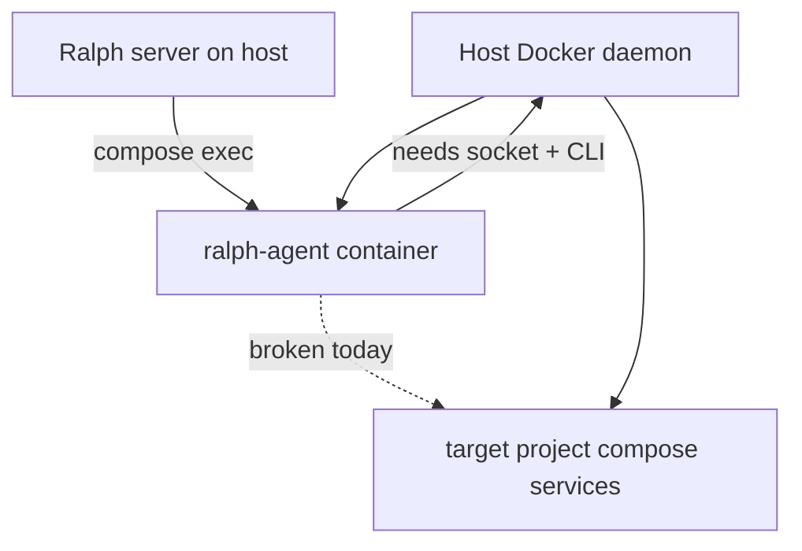
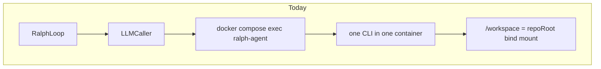
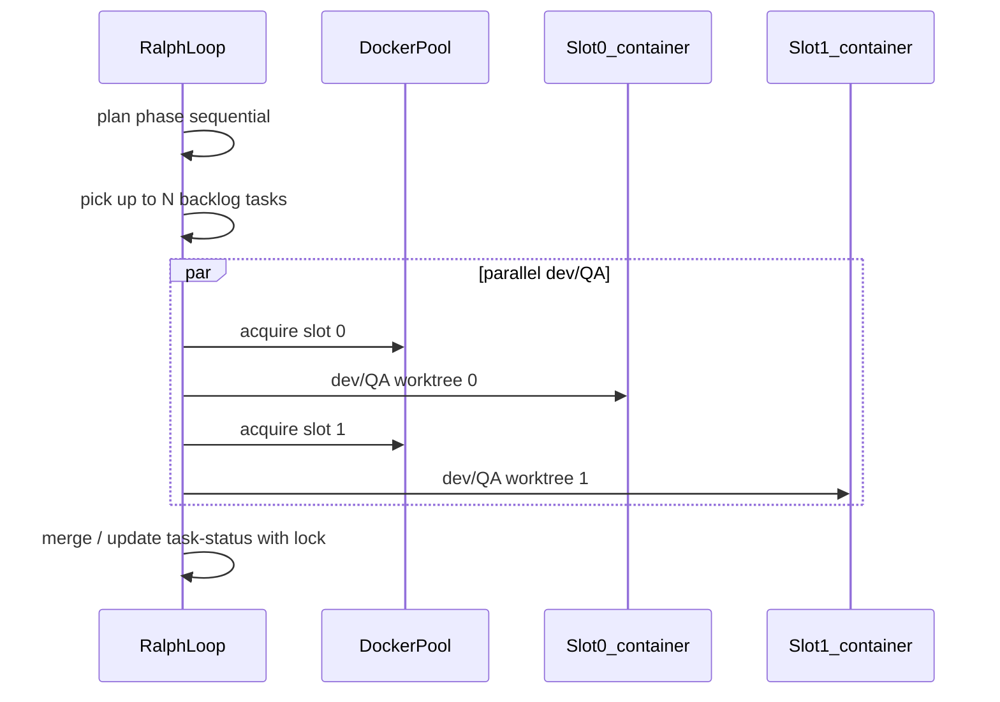
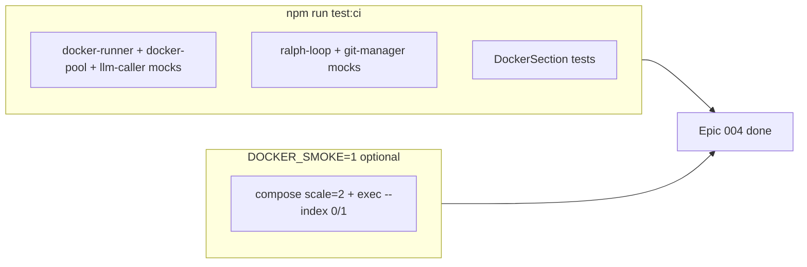

# Epic 004 — Parallel Docker agents and multi-CLI image

**Canonical plan:** [docs/epics/epic-004-parallel-docker-support.plan.md](epic-004-parallel-docker-support.plan.md) — future updates for this epic belong in this file only.

**Depends on:** [Epic 003 — Docker container agents](epic-003-docker-container.plan.md) (single-container Docker transport, branch merge-back, `docker-runner.ts`, `LLMCaller` docker wrapper).

## Goal

1. Build the agent Docker image with **selectable coding-agent CLIs** via Dockerfile **build args** (not Copilot-only).
2. Run **more than one agent container** at a time, with pool size **N configurable in `ralph/settings.json`**.
3. Execute **parallel dev/QA backlog tasks** in separate containers using **git worktree** isolation (minimum viable parallelism).
4. *(Stretch)* Let the **planning agent** dispatch parallel sub-jobs into the container pool; aggregate results before dev picks up tasks.
5. **Document** the new Docker patterns in project README files so operators can build images, size the pool, and troubleshoot without reading source.
6. **Test** the Docker pool pattern end-to-end (automated unit/integration tests plus an optional real-Docker smoke path).
7. Allow **agent containers to run Docker Compose inside the target repo** (nested compose / “Docker-outside-of-Docker” via host socket) so dev tasks like “start full stack + run E2E pytest” are not blocked when Ralph uses `useDocker`.

## Motivation — blocked target-project tasks

Real example (target repo backlog): **“E2E harness test against compose stack”** — agent must run:

```bash
docker compose -f docker/docker-compose.yml up -d --build
RUN_E2E_TESTS=1 pytest tests/e2e -v -m e2e
```

When the coding agent runs **inside** `ralph-agent` without Docker privileges, `docker compose up` fails with errors like *cannot create containers / mount namespaces*. Ralph records the task as **blocked** even though the **host** has Docker installed.

Today’s flow only uses the host daemon to **exec into** `ralph-agent`; the agent CLI does **not** get a working Docker client for the mounted `/workspace` project.



## Decisions (locked in)

| Topic | Choice |
|-------|--------|
| Image strategy | **Build args** — `INSTALL_COPILOT`, `INSTALL_CLAUDE`, `INSTALL_GEMINI`, `INSTALL_CURSOR` (default Copilot `true`, others `false`) |
| Parallelism scope (v1) | **Dev + QA only** across backlog items; **plan phase stays sequential** until stretch phase |
| Isolation model | **Git worktrees** per pool slot under `<repoRoot>/.ralph/worktrees/slot-<n>`; same `.git` object store as host bind-mount |
| Pool sizing | `dockerPoolSize` in settings (default `1`, capped e.g. at `8`) |
| Parallel toggle | `dockerParallelTasks` — enable parallel backlog execution when `dockerPoolSize > 1` |
| Exec targeting | `docker compose exec --index <n>` per slot (requires recent Compose plugin) |
| Fleet vs pool | **Complementary** — Copilot `/fleet` is in-container subagents; pool is multiple containers for different backlog tasks |
| Stretch plan dispatch | Behind `dockerPlanParallel` (default off), requires pool infrastructure from Phase 2 |
| Nested compose (target repo) | **Opt-in** `dockerMountSocket` (default `false`); mount host `docker.sock`, install **Docker CLI + Compose plugin** in agent image when `INSTALL_DOCKER_CLI=true` |
| Nested compose security | Document that socket mount grants effective **host Docker access**; never enable in untrusted multi-tenant images |
| Sandboxed CI | If the **host** forbids container creation (no socket, no privileges), task stays blocked — document “run on Docker-capable runner” (same as current `blocked.needs`) |

## Current state (after Epic 003)

- [`docker/Dockerfile`](../../docker/Dockerfile) installs only `@github/copilot`.
- [`docker-compose.agents.yml`](../../docker-compose.agents.yml) defines a **single** `ralph-agent` service; Ralph always `docker compose exec`s into one container ([`buildDockerSpawn`](../../src/server/docker-runner.ts)).
- [`LLMCaller`](../../src/server/llm-caller.ts) routes by `agentBackend` inside the container; probes CLI via [`resolveAgentCliInDockerContainer`](../../src/server/docker-runner.ts).
- [`ralph-loop.ts`](../../src/server/ralph-loop.ts) runs **one** LLM call at a time; `LLMCaller` keeps a single `currentProcess` (parallel calls would clobber stop/kill).
- Non-Copilot auth vars are documented in [`docker/README.md`](../../docker/README.md); compose `environment` lists Copilot tokens explicitly; other keys rely on `env_file: .env`.



---

## Phase 1 — Universal agent image (build args)

### Dockerfile ([`docker/Dockerfile`](../../docker/Dockerfile))

```dockerfile
ARG INSTALL_COPILOT=true
ARG INSTALL_CLAUDE=false
ARG INSTALL_GEMINI=false
ARG INSTALL_CURSOR=false
```

| Backend | Install when arg true |
|---------|----------------------|
| `copilot` | `npm install -g @github/copilot@<pinned>` |
| `claude` | `npm install -g @anthropic-ai/claude-code` |
| `gemini` | `npm install -g @google/gemini-cli` |
| `cursor-agent` | Per Cursor install docs; validate fails clearly if `INSTALL_CURSOR=true` but binary missing |

### Compose ([`docker-compose.agents.yml`](../../docker-compose.agents.yml))

- Pass build args from env: `INSTALL_CLAUDE=${INSTALL_CLAUDE:-false}`, etc.
- Forward all auth vars in `environment`: `ANTHROPIC_API_KEY`, `GEMINI_API_KEY`, `CURSOR_API_KEY`, plus existing Copilot/GitHub tokens.

### Validation ([`docker-runner.ts`](../../src/server/docker-runner.ts), `POST /api/docker/validate`)

- Probe **each** backend listed in `settings.dockerInstalledBackends` (or inferred from build).
- Always probe **active** `settings.agentBackend`; warn if selected backend was not built into the image.

### Docs (Phase 1 subset)

See [Documentation updates](#documentation-updates) — at minimum build-arg matrix and multi-CLI rebuild commands in both README files.

---

## Phase 1b — Nested compose (agents spawn target-project containers)

**Problem:** Dev/QA agents in `ralph-agent` cannot run `docker compose` for the **target repo** under `/workspace` unless they can talk to a Docker daemon with permission to create containers.

**Approach (v1): Docker socket forwarding** — not DinD sidecars unless socket mounting is insufficient on a platform.

### Dockerfile ([`docker/Dockerfile`](../../docker/Dockerfile))

When `INSTALL_DOCKER_CLI=true` (build arg, default `false`):

- Install **Docker CLI** and **Compose v2 plugin** in the agent image (e.g. `apt-get install docker-ce-cli docker-compose-plugin` on bookworm, or official static bundles).
- Ensure `docker` and `docker compose` work when `DOCKER_HOST` points at the mounted socket.

Keep image slim when nested compose is not needed (`INSTALL_DOCKER_CLI=false`).

### Compose ([`docker-compose.agents.yml`](../../docker-compose.agents.yml))

Opt-in volume (controlled by env at `compose up` time):

```yaml
volumes:
  - ${RALPH_REPO_ROOT:-.}:/workspace
  # When RALPH_DOCKER_SOCKET=1:
  - ${DOCKER_SOCKET:-/var/run/docker.sock}:/var/run/docker.sock
environment:
  - DOCKER_HOST=unix:///var/run/docker.sock   # when socket mounted
```

Use compose **profiles** or override file `docker-compose.agents.nested.yml` so default remains socket-free.

### Settings ([`settings-manager.ts`](../../src/server/settings-manager.ts), [`DockerSection.tsx`](../../src/client/components/DockerSection.tsx))

```ts
dockerMountSocket: boolean;  // default false — enable for target repos that run compose/E2E inside the agent
```

UI:

- Checkbox **Allow agents to run Docker in the target repo** (mount host Docker socket).
- Warning: grants host-level Docker control; only use on trusted machines.
- When enabled, **Set Docker** runs **inside** the agent container: `docker info` and `docker compose version` must succeed.

### Validation ([`docker-runner.ts`](../../src/server/docker-runner.ts))

Extend `ensureDockerAgentRunning` / validate when `dockerMountSocket`:

1. Host: confirm socket path exists (`/var/run/docker.sock` or `DOCKER_SOCKET` env).
2. Container: `docker compose exec … docker info` exit 0.
3. Container: `docker compose -f /workspace/<known-test-path> config` optional smoke if target repo provides `docker/docker-compose.yml` (best-effort, do not fail validate if file missing).

### Dev prompt / blocked-task guidance

- Inject into dev/QA context when `dockerMountSocket` is on: “You may run `docker compose` against files under `/workspace`; daemon is the host via mounted socket.”
- When validate fails with permission errors, set `blocked.needs` to mention enabling **Allow agents to run Docker** or running Ralph with `useDocker: false` on the host.

### Target-project E2E pattern (reference)

Document the harness pattern this unlocks (from real blocked task):

| Step | Command / check |
|------|-----------------|
| Preflight | `docker compose -f docker/docker-compose.yml config` |
| Stack up | `docker compose -f docker/docker-compose.yml up -d --build` |
| Health | postgres, airflow-*, eventhub-emulator, ui healthy |
| Tests | `RUN_E2E_TESTS=1 pytest tests/e2e -v -m e2e` |
| Accept | job `done`, `crud_counts.add == 10`, events `published`, SSE ≥ 10 events |

Ralph does not implement this test — the **agent** runs it inside the container once nested Docker works.

### Alternatives (document only, not v1)

| Approach | When |
|----------|------|
| `useDocker: false` | Run agent on host; host Docker already works |
| Privileged DinD | Only if socket mounting blocked; higher risk |
| Remote Docker context | Advanced CI; `DOCKER_HOST=tcp://…` |

### Tests (Phase 1b)

- Unit: compose file generation includes socket volume when `dockerMountSocket` setting mapped to `RALPH_DOCKER_SOCKET=1`.
- Mocked exec: validate runs `docker info` inside container when flag set.
- Smoke (`DOCKER_SMOKE=1` + socket): agent container runs `docker run --rm hello-world` or `docker compose ls` (host must allow).

---

## Phase 2 — Container pool + worktree isolation

### Settings ([`settings-manager.ts`](../../src/server/settings-manager.ts), [`types.ts`](../../src/client/types.ts), [`DockerSection.tsx`](../../src/client/components/DockerSection.tsx))

```ts
dockerPoolSize: number;                    // default 1, min 1, max 8
dockerParallelTasks: boolean;              // default false
dockerInstalledBackends?: AgentBackendId[]; // optional, for validate UI
// Stretch:
dockerPlanParallel?: boolean;              // default false
```

UI: **Pool size** number input, **Run backlog tasks in parallel** checkbox (disabled when `dockerPoolSize === 1`).

### Compose scaling

```bash
docker compose -f ... up -d --scale ralph-agent=${dockerPoolSize}
```

Update [`buildDockerSpawn`](../../src/server/docker-runner.ts):

```ts
buildDockerSpawn(composeFile, service, command, commandArgs, { containerIndex?: number })
// appends: exec ... --index N when set
```

### New module: [`docker-pool.ts`](../../src/server/docker-pool.ts)

| Function | Behavior |
|----------|----------|
| `ensureDockerPool(...)` | Scale service, wait for N running containers, probe toolchain + CLIs per index |
| `listPoolContainers(...)` | Ordered container IDs from `docker compose ps -q` |
| `acquireSlot()` / `releaseSlot()` | In-memory allocator: slot 0..N-1 → container index |

### Git worktrees ([`git-manager.ts`](../../src/server/git-manager.ts))

1. Loop start: create worktrees `.ralph/worktrees/slot-<n>` from `epicBaseBranch` / `dockerWorkBranch`.
2. `buildDockerSpawn` uses `-w /workspace/.ralph/worktrees/slot-n` (single repo mount).
3. Task done: merge worktree branch into work/epic branch (extend merge API for conflicts).
4. Cleanup: default keep worktrees; document `git worktree remove`.

### `LLMCaller` concurrency ([`llm-caller.ts`](../../src/server/llm-caller.ts))

- Replace `currentProcess` with `Map<slotId, ChildProcess>`; `stop()` kills all.
- Extend `LLMCallOpts`: `dockerContainerIndex?`, `dockerWorktreeCwd?`.

### `ensureDockerAgentRunning`

Wrap or extend: when `dockerPoolSize > 1`, call pool ensure and validate exec on indices `0..N-1`.

---

## Phase 3 — Parallel dev/QA ([`ralph-loop.ts`](../../src/server/ralph-loop.ts))

When `useDocker && dockerParallelTasks && dockerPoolSize > 1`:



- **Mutex** on [`TaskManager`](../../src/server/task-manager.ts) writes.
- Cap in-flight tasks at `dockerPoolSize`.
- Plan phase unchanged in v1.

---

## Phase 4 (stretch) — Planning agent dispatches pool jobs

1. Extend plan prompt for structured parallel research sub-prompts.
2. Parse plan output; `Promise.all` dispatch sub-jobs to pool (slot + scratch/read-only worktree).
3. Aggregate into backlog / `task-status.json`.
4. Gated by `dockerPlanParallel` and `dockerPoolSize > 1`.

---

## Documentation updates

Documentation is a **deliverable** for this epic, not an afterthought. Update both README files whenever behavior or settings change.

### [`README.md`](../../README.md) — project root

Extend **Docker Agent Execution** (and **Settings Defaults** / **CLI flags** as needed):

| Topic | What to document |
|-------|------------------|
| Multi-CLI image | `INSTALL_*` build args; example `docker compose build` with env; link to `docker/README.md` for detail |
| Pool | `dockerPoolSize`, `dockerParallelTasks` in settings table; default `1`; max and resource warning |
| Parallel tasks | Dev/QA only; requires `useDocker` + pool > 1; worktrees under `.ralph/worktrees/` |
| Validate | **Set Docker** checks active backend CLI + (when pool > 1) all container indices reachable |
| Compose scale | `up -d --scale ralph-agent=N` equivalent; recreate after `.env` / build-arg changes |
| Fleet vs pool | Short note: `/fleet` is per-container Copilot subagents; pool is multiple backlog tasks |
| CLI flags | `--docker-pool-size`, `--docker-parallel-tasks` (if added in [`cli-args.ts`](../../src/server/cli-args.ts)) |
| Troubleshooting | Wrong CLI in image, `--index` unsupported (upgrade Compose), worktree merge conflicts |
| Nested compose | `dockerMountSocket`, security warning, `INSTALL_DOCKER_CLI`, blocked-task “cannot create containers” |

Add a one-line pointer under Epic/docs if useful: “Parallel Docker pool — see [Epic 004](docs/epics/epic-004-parallel-docker-support.plan.md).”

### [`docker/README.md`](../../docker/README.md) — operator guide

Add or expand sections:

1. **Build the image for your backends** — table of `INSTALL_COPILOT` / `INSTALL_CLAUDE` / `INSTALL_GEMINI` / `INSTALL_CURSOR`, sample `.env` + compose build, pinned versions.
2. **Run a container pool** — `dockerPoolSize`, scale command, verify `docker compose ps` shows N instances.
3. **Parallel dev/QA and worktrees** — directory layout, branch naming, merge-back relationship to Epic 003 work branch.
4. **Validate from Ralph** — what **Set Docker** probes (per-backend CLI, per-index exec, node/git/pnpm).
5. **Troubleshooting** — new rows: pool not scaling, exec lands on wrong index, worktree already exists, parallel task file conflicts.
6. **Nested Docker (target repo compose)** — enable socket mount, `INSTALL_DOCKER_CLI`, verify `docker info` inside agent, E2E harness checklist, when to use host `useDocker: false` instead.

Keep [Step 2 — authentication](docker/README.md#step-2--add-authentication-env) aligned: every backend env var listed in compose `environment`, not only Copilot.

### Optional

- [`docs/requirements.md`](../../docs/requirements.md) — checklist items for Epic 004 when shipped.
- Cross-link from [Epic 003](epic-003-docker-container.plan.md) footer: “Follow-on: Epic 004 (parallel pool, multi-CLI image).”

---

## Files to touch

| Area | Files |
|------|--------|
| Image / compose | [`docker/Dockerfile`](../../docker/Dockerfile), [`docker-compose.agents.yml`](../../docker-compose.agents.yml), [`docker/README.md`](../../docker/README.md) |
| Pool + spawn | [`docker-runner.ts`](../../src/server/docker-runner.ts), new `docker-pool.ts`, tests |
| Git | [`git-manager.ts`](../../src/server/git-manager.ts) |
| Loop / LLM | [`ralph-loop.ts`](../../src/server/ralph-loop.ts), [`llm-caller.ts`](../../src/server/llm-caller.ts) |
| API / UI | [`index.ts`](../../src/server/index.ts), [`DockerSection.tsx`](../../src/client/components/DockerSection.tsx) |
| Docs | [`README.md`](../../README.md), [`docker/README.md`](../../docker/README.md) |
| Tests | See [Testing](#testing) |

---

## Risks and constraints

- **Resources:** `dockerPoolSize` concurrent agents multiply CPU/RAM/API usage — enforce max in settings validation.
- **Cursor CLI in Docker:** may not be a single `npm install`; document manual steps if build arg cannot automate.
- **Compose `--index`:** require recent Compose plugin; validate API should suggest upgrade on failure.
- **Git conflicts:** parallel worktree merges need conflict paths like today's merge-epic-work API.
- **Socket mount security:** agents can start arbitrary host containers; default off; call out in UI and README.
- **Nested compose on locked-down hosts:** Cursor/cloud sandboxes without socket or cgroup rights will still block — same outcome as task #13 `blocked.needs`; not fixable in software alone.

---

## Implementation order

1. Phase 1 — build-arg Dockerfile + compose env + multi-CLI validate + **README build-arg docs**
2. **Phase 1b** — `INSTALL_DOCKER_CLI`, optional socket mount, `dockerMountSocket` setting, in-container `docker info` validate, nested-compose docs (unblocks target-repo E2E/compose tasks)
3. Phase 2 — settings, `docker-pool.ts`, scale + `--index`, worktrees, multi-process `LLMCaller` + **unit tests for pool/spawn**
4. Phase 3 — parallel `runDevQALoop` with task-manager lock + **ralph-loop / integration tests**
5. **Documentation pass** — finalize [`README.md`](../../README.md) and [`docker/README.md`](../../docker/README.md) (pool, parallel, nested compose, troubleshooting)
6. **Docker smoke** (optional script, local/CI when `DOCKER_SMOKE=1`) — scaled pool + nested `docker info` inside agent when socket enabled
7. Phase 4 — plan-phase pool dispatch (stretch PR)

---

## Testing

Tests must prove the **new Docker pattern works** without requiring every `npm test` run to have Docker installed. Use mocks for default CI; gate real-Docker checks behind an env flag.

### Unit tests (required — run in `npm test` / `test:ci`)

| File | Coverage |
|------|----------|
| [`docker-runner.test.ts`](../../src/server/docker-runner.test.ts) | `buildDockerSpawn` with `containerIndex` → argv includes `--index N`; multi-backend CLI probe errors; nested validate runs in-container `docker info` when `dockerMountSocket` |
| **new** [`docker-pool.test.ts`](../../src/server/docker-pool.test.ts) | `ensureDockerPool` passes `--scale`; `listPoolContainers` ordering; `acquireSlot` / `releaseSlot` exhaustion and release |
| [`llm-caller.test.ts`](../../src/server/llm-caller.test.ts) | Two parallel `call()` with different `dockerContainerIndex`; `stop()` kills all tracked processes; worktree cwd in spawn argv |
| [`git-manager.test.ts`](../../src/server/git-manager.test.ts) | Create/remove worktree per slot (mocked `spawn` / temp git repo) |
| [`ralph-loop.test.ts`](../../src/server/ralph-loop.test.ts) | When `dockerParallelTasks` + pool 2, dispatches at most two dev paths (mock `LLMCaller`) |
| [`components.test.tsx`](../../src/client/components/components.test.tsx) | Pool size input; parallel checkbox disabled when `dockerPoolSize === 1` |
| [`cli-args.test.ts`](../../src/server/cli-args.test.ts) or existing pattern | New flags map to settings if added |

**Definition of done (automated):** `npm run test:ci` passes with zero Docker daemon dependency.

### Integration-style tests (mocked Docker, required)

- Validate API path: mock `ensureDockerPool` / `resolveAgentCliInDockerContainer` — `POST /api/docker/validate` returns ok when pool size 2 and all indices probed (extend server tests or `docker-runner` integration).
- Regression: single-container path (`dockerPoolSize: 1`) unchanged — existing `llm-caller` docker tests still pass.

### Optional: real Docker smoke (local / CI job)

Add [`scripts/docker-pool-smoke.mjs`](../../scripts/docker-pool-smoke.mjs) (or document manual steps in `docker/README.md`):

1. Skip unless `DOCKER_SMOKE=1` and `docker info` succeeds.
2. Build image with `INSTALL_COPILOT=true` (minimal).
3. `docker compose -f docker-compose.agents.yml up -d --scale ralph-agent=2 --build`.
4. Assert two running containers; `docker compose exec --index 0` and `--index 1` both run `node -v` and `command -v copilot`.
5. Tear down: `docker compose down`.

Document in README: “CI does not run Docker smoke by default; maintainers run `DOCKER_SMOKE=1 node scripts/docker-pool-smoke.mjs` before release.”

### Manual QA checklist (before closing epic)

- [ ] Build with `INSTALL_CLAUDE=true`, switch Settings to `claude`, **Set Docker** succeeds
- [ ] `dockerPoolSize=2`, parallel tasks on, two backlog items run without interleaved file corruption
- [ ] Stop loop mid-parallel — both container exec processes terminate
- [ ] README and docker/README steps reproduce setup on a clean machine
- [ ] `dockerMountSocket` enabled: inside `ralph-agent`, `docker info` succeeds and target-repo `docker compose config` parses
- [ ] Representative target task (compose up + pytest e2e) completes or fails with actionable errors, not “cannot create containers” inside agent


