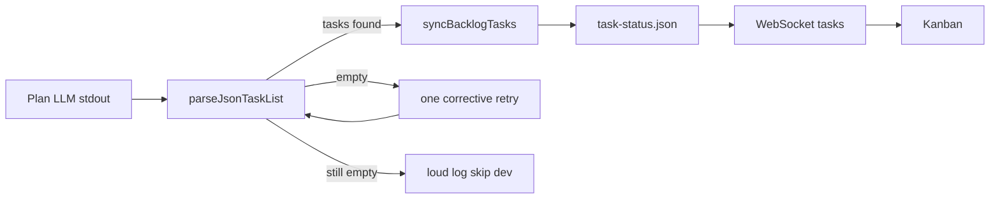

# Epic 005 — Kanban sync and thorough agent prompts

The plan agent is **not** supposed to write [`ralph/task-status.json`](../../ralph/task-status.json). The loop parses a fenced JSON array from plan stdout and calls `TaskManager.syncBacklogTasks`. When that parse misses, the board stays empty and the only log is `no backlog task found after planning` — so it looks like the plan step never updated the file.

Keep engine-owned persistence. Make parse + logging reliable, then make the three prompts match that contract. Do not invent project documents (epic, requirements) on disk — Settings already has paths for wherever the target repo keeps them.



## 1. Make plan JSON parse actually succeed

Today [`parseJsonTaskList`](../../src/server/parse-output.ts) and the duplicate in [`src/shared/parseTaskList.ts`](../../src/shared/parseTaskList.ts) only match a fenced JSON block that has a newline after the opening fence and a newline before the closing fence. That misses common model output: a fence with no `json` label, a closing fence on the same line as `]`, string IDs (`"id": "1"`), trailing commas, or a raw JSON array with no fence.

**Single implementation** in [`src/shared/parseTaskList.ts`](../../src/shared/parseTaskList.ts); [`parse-output.ts`](../../src/server/parse-output.ts) re-exports it so tests and the loop stay on one path.

Parser behavior:

- Prefer the last fenced JSON/unlabeled code block that parses as an array of objects
- Fall back to the last JSON array in the text (unfenced)
- Coerce numeric string IDs (`"3"` → `3`); skip only truly invalid rows
- Strip trailing commas before `JSON.parse`
- Default missing `status` to `backlog`; keep existing skip rules for missing title

Expand tests in [`src/server/parsers.test.ts`](../../src/server/parsers.test.ts) (and a small shared-parser test if needed) for those cases.

## 2. Stop failing silently in the loop

In [`ralph-loop.ts`](../../src/server/ralph-loop.ts) after the plan call (and in `refreshBacklog`):

- If JSON and legacy bullet parsers both return empty **and** the output is not `<status>complete</status>`: log a clear error (`Plan output had no parseable task list — Kanban not updated`) plus a short snippet of the model output
- **Retry the plan once** with a short correction suffix: output only a fenced JSON array of remaining backlog tasks with numeric `id`, `title`, `description`, and `status: "backlog"`
- If still empty: skip the dev loop as today, but do not keep the user guessing
- On success, keep the existing `[ralph] Synced N tasks from plan output (json)` log (that is the signal the file was written)

Fix the stale comment at ~L600 (“fallback if the plan agent didn't write task-status.json”).

## 2b. Kanban board through the full development process (including Docker)

Parse-and-sync is not enough. The board must stay truthful for the rest of the loop so the user can see what is happening without reading the log.

**Status transitions that must appear live** (each `TaskManager` write already broadcasts `type: "tasks"`; verify that happens and that [`groupTasks`](../../src/client/types.ts) puts the card in the right column):

- After a successful plan (or backlog refresh): remaining work in **Backlog**
- Task claimed: **Backlog** → **In Progress**
- QA starts: **In Progress** → **In QA**
- QA pass: **In QA** → **Done**
- QA fail: **In QA** → **In Progress** (retry) with feedback on the card/log
- Dev blocked: **blocked** still visible (today under In Progress); do not vanish or look idle
- Header **Task** / **LLM Calls** stay consistent with `task-status.json`

**Local (no Docker) and Docker serial** (`useDocker` with pool size 1): same column behavior as above. Do not treat Docker as a second, untested path.

**Docker parallel** (`dockerPoolSize > 1` and **Run backlog tasks in parallel**): several tasks may be In Progress and In QA at once. The board must show **all** of them, not only the last writer.

- `setTaskStatus` is already under `withTaskLock`; confirm parallel slots cannot clobber another task’s `status`, `devIterations`, or `blocked` metadata
- Single `nextTask` / `currentTaskNum` fields are one-slot today (called out in epic-004). Fix or stop relying on them for the board: columns must use `tasks[]`. Header/log “current task” should not imply only one worker when several are running (e.g. show the in-flight count or the set of active ids)
- Plan-parallel research merges (`dockerPlanParallel`) must update **Backlog** when sub-jobs return task JSON
- After a slot finishes, that card moves to Done/Blocked/retry without resetting siblings

**Tests** (required, not optional):

- Loop unit tests: after mocked plan JSON, `tasks` contains backlog items and a `tasks` callback/WS payload would include them
- Serial path: mock dev `done` + QA `verified` / `failed` / `blocked` and assert column statuses on `StatusData.tasks`
- Parallel path: `dockerParallelTasks` + pool size 2, two backlog items, assert both become `inProgress` (and later `inQa`/`done`) independently — extend [`ralph-loop.test.ts`](../../src/server/ralph-loop.test.ts) parallel dispatch coverage beyond “both LLM calls started”
- Client: `groupTasks` / column render for mixed `backlog` + two `inProgress` + `inQa` + `done` + `blocked`
- Do not add a dedicated Blocked column (out of scope); do assert blocked cards remain visible

## 3. Make plan / dev / QA agents smarter, more robust, and more thorough

The current templates are thin checklists. Rewrite them so each phase **thinks, verifies, and only then signals** — not just “emit the right tag.” Update factory templates in [`src/server/prompts/`](../../src/server/prompts/) **and** this repo’s runtime copies in [`ralph/plan-prompt.md`](../../ralph/plan-prompt.md), [`ralph/dev-prompt.md`](../../ralph/dev-prompt.md), [`ralph/qa-prompt.md`](../../ralph/qa-prompt.md) (bootstrap never overwrites existing files).

**Smarter** = use injected requirements + epic + memory + the real codebase; do not invent work or skip existing work. **Thorough** = cover remaining scope, tests, and acceptance; do not ship a one-line task or an untested change. **Robust** = never lie about completion; if evidence is missing, fail/retry/block instead of passing.

Shared rules in all three:

- Requirements (Project Overview) and current epic are authoritative; if they conflict with code, note it and plan/fix toward the docs
- Read `ralph/memory.md` first and apply it; append only new, non-obvious learnings (commands, conventions, landmines)
- Use only US English keyboard characters
- The loop owns `ralph/task-status.json` — agents must not write it
- Memory append is the one allowed extra write
- Do not claim done/verified/complete without having inspected the repo (and run checks when the task involves code)

**Plan** ([`plan-prompt.md`](../../src/server/prompts/plan-prompt.md)) — thorough backlog, not a vibe list:

- Drop “select the next task”; the loop always takes the first `backlog` item after sync
- Before emitting JSON: read memory, survey the tree (existing features, tests, docs), compare to requirements + epic, and list gaps
- Emit **all remaining work** needed to finish the epic: features, integrations, tests, docs, migrations, follow-ups. Do not emit `<status>complete</status>` unless the epic is actually done in the repo
- Split work into the smallest tasks that can be implemented and QA’d independently; order by dependencies (foundations first). When Docker parallel is on, avoid two tasks that edit the same files
- Each task description must be implementation-ready: what/why, likely files or areas, approach, tests to add or run, and acceptance criteria a QA pass can check. No empty or one-sentence descriptions
- Preserve IDs for the same intent; new IDs from max+1; exclude done/blocked; every emitted `status` is `"backlog"`
- JSON fence is the **last** output (or only `<status>complete</status>`). Numeric `id` values. That JSON is what fills the Kanban — if it is missing or malformed, the board stays empty
- Short `<research-prompt>` note for parallel plan research (parser already exists)
- Allow `ralph/memory.md` append; forbid writing `task-status.json`. Fix “implimentation”

**Dev** ([`dev-prompt.md`](../../src/server/prompts/dev-prompt.md)) — finish the task, do not stub it:

- Read the full task (title + description + acceptance) and inspect related code, tests, and config before editing
- Implement the root cause; match project patterns; do not leave TODOs, skipped tests, or placeholder UI for required behavior
- Add or update tests for behavior you change; run the relevant build, lint, and tests (platform-appropriate) and **use those results**. If a check fails, fix it in this pass
- QA feedback is a continuation: address every valid item, then re-run the same checks
- Resume from resolved-blocker `nextStep` / `needs` when present
- `<status>done</status>` only after validation actually ran and passed; it must be the last non-empty line. `blocked` only after exhausting options the agent can do itself (missing secrets, external access, contradictory requirements) — include the blocked-* tags
- Do not emit `done` because the prompt asked for a status tag

**QA** ([`qa-prompt.md`](../../src/server/prompts/qa-prompt.md)) — adversarial review, not a rubber stamp:

- Re-read the task, requirements, and epic. Inspect the diff and surrounding code. Run the same class of build/lint/test the task called for. **No code changes**
- Check completeness (acceptance criteria met), correctness (edge cases, regressions), tests (present and meaningful), and conventions
- Pass only if you ran checks and they passed **and** the task is actually complete: `<status>verified</status>` as the last non-empty line
- Fail with specific, actionable `# Feedback` bullets (file + what to change) and `<status>failed</status>` as the last line. Do not emit `verified` to “keep the loop moving”
- Flag missing tests, leftover stubs, and unmet acceptance — not style nits that do not affect correctness

## 4. Do not auto-create Settings-owned project documents

[`RalphFileManager.bootstrap()`](../../src/server/ralph-file-manager.ts) currently `writeIfMissing("epic.md", DEFAULT_EPIC)` whenever a repo is set. That plants a placeholder at `ralph/epic.md` even when the real epic lives elsewhere (`docs/epic.md`, `ralph/epic.md` in another layout, etc.). Settings then looks like it found an epic, so the user never gets a chance to point `epicFile` at the real file.

**Stop auto-creating:**

- **Epic** — remove `writeIfMissing("epic.md", epic)` from bootstrap. Keep `migrateGoalsToEpic()` (copy existing `ralph/goals.md` → `ralph/epic.md` only if epic is absent); that is migration, not a placeholder. Default `epicFile` stays `ralph/epic.md`. If that path is missing, [`readEpic()`](../../src/server/ralph-loop.ts) already returns `""`, `epicConfigured` stays false, and the loop cannot start until the user Sets a real path or creates a file.
- **Requirements** — already not created by bootstrap; keep it that way. Auto-discover or use `requirementsFile` from Settings; if missing, show the existing “not found / update the path” hint. Do not seed `requirements.md`.

**Still bootstrap** (Ralph-owned, not project docs): `plan-prompt.md`, `dev-prompt.md`, `qa-prompt.md`, `memory.md`, `settings.json`.

**Create only when the user asks:**

- Epic: existing Settings **Set** → not found → **Create** dialog ([`EpicSection`](../../src/client/components/EpicSection.tsx) + `POST` create handler in [`index.ts`](../../src/server/index.ts)). Saving epic content the user typed is also explicit.
- Requirements: user creates the file in the repo (or we only write if they later add an explicit create action — do not add silent create now).

Update [`RalphLoop.bootstrap` tests](../../src/server/ralph-loop.test.ts): expected files no longer include `epic.md`; add a case that bootstrap does not create `ralph/epic.md` or a requirements file. Tests that assumed epic exists after bootstrap must write the epic themselves or Set a path.

## 5. Settings panel: stop auto-close and lost drafts

Two bugs in [`App.tsx`](../../src/client/App.tsx) + [`ControlPanel.tsx`](../../src/client/components/ControlPanel.tsx):

**Closes itself.** Visibility is `showSettings || !isReady`. Setup force-opens the panel with `showSettings` still `false`. As soon as repo + requirements + epic become ready, `isReady` flips and the panel **unmounts** — wiping drafts, section expand state, and the epic Create dialog. The X button sets `showSettings(false)` but while setup is incomplete the panel stays; finishing the epic then makes it vanish.

**Loses in-progress edits.** ControlPanel copies server props into local state on every change:

```ts
useEffect(() => setLocalSettings(...), [settings]);
useEffect(() => setLocalEpic(epic), [epic]);
useEffect(() => setLocalPrompt(...), [prompts, activePrompt]);
```

WebSocket `init` (reconnect) and `settings` / `epic` broadcasts replace those objects, so typing in epic/prompts/loop fields gets overwritten. Saving one slice can also broadcast and reset the others.

**Fixes:**

- Open state is user-owned. Force-open **once** when setup is incomplete (so first visit still shows Settings). Never auto-close when `isReady` becomes true. Gear toggles; X always closes. Setup banner remains if they close early.
- Do not unmount the panel on a readiness flip. If we hide it, only do so after an explicit close.
- Apply server → local sync only for **clean** slices (not dirty). Always reset drafts when `repoRoot` changes (intentional repo switch).
- Epic Create dialog stays until Create or Cancel; remount/readiness must not dismiss it (comes for free if the panel stays mounted and drafts are not clobbered).
- Allow closing during incomplete setup (`canClose` should not trap the user); Start stays disabled until ready.

**Tests** in [`components.test.tsx`](../../src/client/components/components.test.tsx) / App if needed: panel still visible after readiness becomes true until close; dirty epic/settings survive a `settings`/`epic` prop update; repo change resets drafts.

## 6. Resync available models from the coding-agents doc

Treat [`docs/coding-agents-available-models.md`](../coding-agents-available-models.md) as the source of truth. The live catalog is [`src/shared/agent-models.ts`](../../src/shared/agent-models.ts) (`AGENT_MODEL_CATALOG`, `PREFERRED_MODELS_BY_BACKEND`, `LEGACY_MODEL_ALIASES`). Loop Config already reads that catalog for Plan/Dev/QA dropdowns and **View models**; keep that flow — do not duplicate lists in the UI.

Diff the five tables (Cursor Agent, Claude Code, Gemini, Copilot, OpenCode) into the catalog:

- Exact CLI `--model` / `-m` IDs, labels, strength, tier, multiplier, YOLO, fleet text
- `preferredFor` from the **Preferred For** column (Planning / Dev / QA)
- Preferred triple per backend from those columns (already: Copilot plan `claude-sonnet-4.6` + Dev/QA `gpt-5.4-mini`; Cursor plan `claude-sonnet-5-thinking-high` + Dev/QA `gpt-5.4-mini-medium`; Claude plan `claude-sonnet-4-6` + Dev/QA `claude-haiku-4-5`; Gemini plan `gemini-3-pro-preview` + Dev/QA `gemini-3-flash-preview`; OpenCode plan `opencode/big-pickle` + Dev/QA `opencode/deepseek-v4-flash-free`)
- Add aliases for any IDs removed from the catalog so saved `settings.json` still resolves
- Drop catalog rows that are no longer in the doc

**Coordinating UI / defaults** (same catalog, no second list):

- [`LoopConfigSection.tsx`](../../src/client/components/LoopConfigSection.tsx) dropdown labels stay `formatModelOptionLabel` (`(id) Label -- recommended for …`)
- Keep **Custom…** for IDs not in the catalog
- Switching backend still uses `resolveModelsForBackend` / `savedModelsByBackend`
- **Fleet mode** checkbox: enable when the doc’s Fleet Mode is **Yes** (`copilot`, `claude`). Leave **Partial** / **No** (Cursor, OpenCode, Gemini) disabled and update the hint so it is not Copilot-only
- [`/models-reference`](../../src/server/models-reference.ts) and `GET /api/agent-models` stay generated from the catalog
- Align factory defaults with Copilot preferred: [`settings-manager.ts`](../../src/server/settings-manager.ts) `DEFAULT_SETTINGS`, [`useRalph.ts`](../../src/client/hooks/useRalph.ts) fallback, README `--plan-model` examples
- `normalizeSettingsModels` on settings read so existing repos pick up renamed IDs

**Tests:** [`agent-models.test.ts`](../../src/shared/agent-models.test.ts) (IDs, preferred-in-catalog, counts, aliases), [`models-reference.test.ts`](../../src/server/models-reference.test.ts), Loop Config dropdown tests in [`components.test.tsx`](../../src/client/components/components.test.tsx). Add a check that every catalog `id` appears in the matching markdown table (or the reverse: every table ID is in the catalog) so the lists cannot drift again.

## 7. Tests to add

- Parser: unlabeled fence, same-line close, string IDs, trailing commas, raw array, last-of-several fences
- Loop: empty parse logs the warning; successful JSON still calls `syncBacklogTasks` (extend [`ralph-loop.test.ts`](../../src/server/ralph-loop.test.ts) if the plan-phase path is mockable; otherwise unit-test a small helper that wraps parse + retry decision)
- Kanban lifecycle: serial and Docker-parallel status transitions as in section 2b (backlog → inProgress → inQa → done/retry/blocked; multiple in-flight cards)
- Bootstrap: no `ralph/epic.md` / requirements file unless they already existed or the user created them
- Settings: open/close and dirty-draft persistence as above
- Models: catalog matches the markdown tables; preferred IDs; fleet checkbox enablement; models-reference rows

## Out of scope

- Letting the plan agent write `task-status.json` directly
- Control Panel “reset prompts to factory” (existing `--repo` copies still need a manual save/replace to pick up new templates)
- New Kanban columns or drag-and-drop
- Auto-creating requirements from a template
