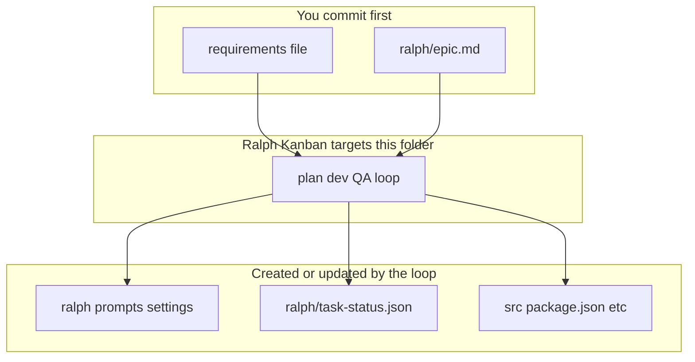

# Experiments

Each folder here is a **Ralph target repository**: at minimum a requirements file (see root `README.md` → *Required Requirements File*) and `ralph/epic.md`. Ralph bootstraps the rest of `ralph/*` (prompts, `task-status.json`, etc.) when you first point Kanban at that directory.

You may add a **`material/`** subdirectory for screenshots and other static reference files (not app source). That keeps curated example assets separate from generated code under `src/`, `dist/`, and similar. Example: [`experiments/todo/material/`](todo/material/).



**Run Kanban on an experiment** (from ralph-gui root):

```bash
./start.sh exp <slug>
# or
npm run exp -- <slug>
```

**List slugs:** `./start.sh exp` (omit `<slug>`) or `npm run exp` alone (no slug; no `--` needed).

**Headless exit POC** (stub agent, process must exit): `npm run poc:headless-exit` — see [`experiments/headless-exit/`](headless-exit/).

Optional: symlink `~/experiments/<slug>` to this repo’s `experiments/<slug>` if you prefer that path; the launcher always resolves the real directory inside ralph-gui.
